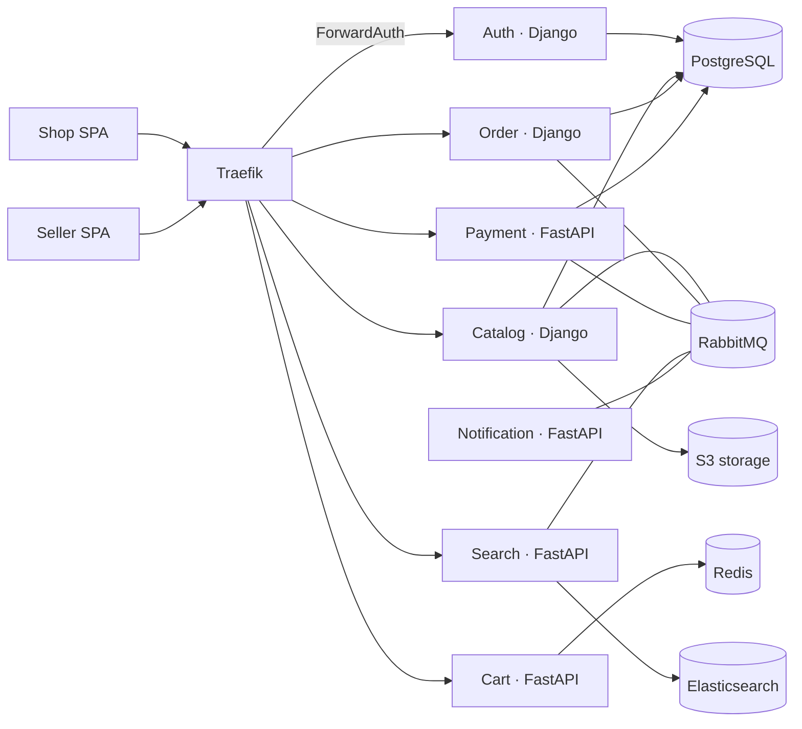

# Bozorcha — multi-vendor marketplace

A multi-seller marketplace built as a microservice monorepo: customers browse and buy,
sellers manage their own shop, and money never leaves an order in an inconsistent state.

> Status: early. The shared contracts, the infrastructure and the service skeletons are in
> place; business features are being added phase by phase.

## Architecture



Each service owns its database and talks to the others only through events on a single
topic exchange. Every state change is written together with its outbox row in one
transaction, and every consumer is idempotent by `event_id`.

| Service | Stack | Responsibility |
|---|---|---|
| auth | Django, DRF | phone + OTP login, JWT, seller applications, gateway ForwardAuth |
| catalog | Django, DRF | shops, categories, products, variants, stock reservations, images |
| order | Django, DRF | checkout, order state machine, sub-orders per seller, commissions |
| cart | FastAPI, Redis | guest and user carts, favourites, merge on login |
| search | FastAPI, Elasticsearch | product search, facets, autocomplete, Uzbek transliteration |
| payment | FastAPI, SQLAlchemy | Payme and Click merchant APIs, refunds, seller payouts |
| notification | FastAPI | Telegram, SMS and email notifications |

## Quick start

Requirements: Docker with Compose, GNU make, and [uv](https://docs.astral.sh/uv/) for
running tests outside containers.

```bash
cp .env.example .env    # then set the passwords
make up                 # build and start the stack
make ps                 # every service should report healthy
```

| URL | What |
|---|---|
| `http://api.localhost/api/<service>/health/live` | service liveness through the gateway |
| `http://traefik.localhost` | routing dashboard |
| `http://rabbit.localhost` | broker management |
| `http://minio.localhost` | object storage |
| `http://mail.localhost` | captured outgoing email |

## Development

```bash
make test        # shared libraries and every service suite
make lint        # ruff check + format check
make typecheck   # mypy, strict
make gen-rabbit  # regenerate the broker topology from the contracts
make down        # stop everything
```

Conventions: money is stored as integer tiyin (1 so'm = 100 tiyin) and never as a float,
identifiers are UUIDv7, timestamps are UTC, and the API error shape is
`{"error": {"code", "message", "details"}}` in every service.

## License

Not published yet.
