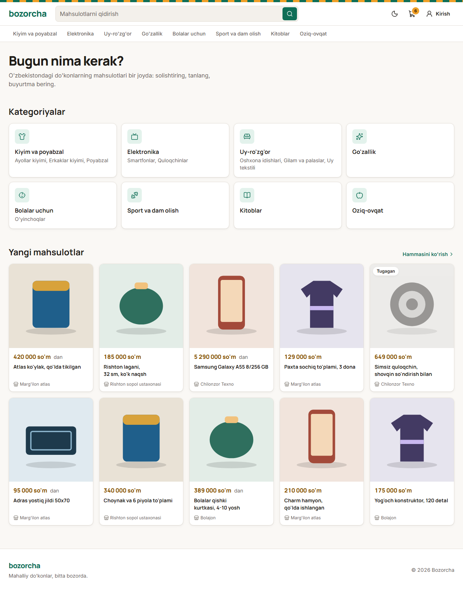
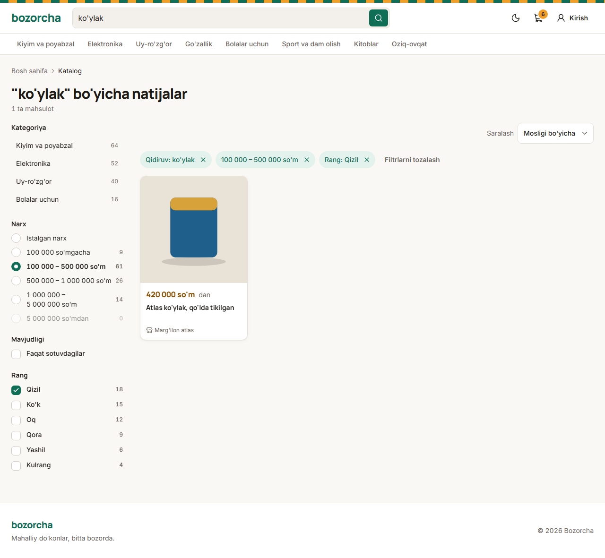
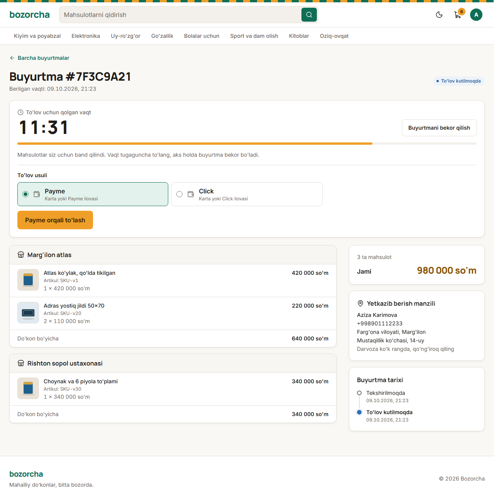
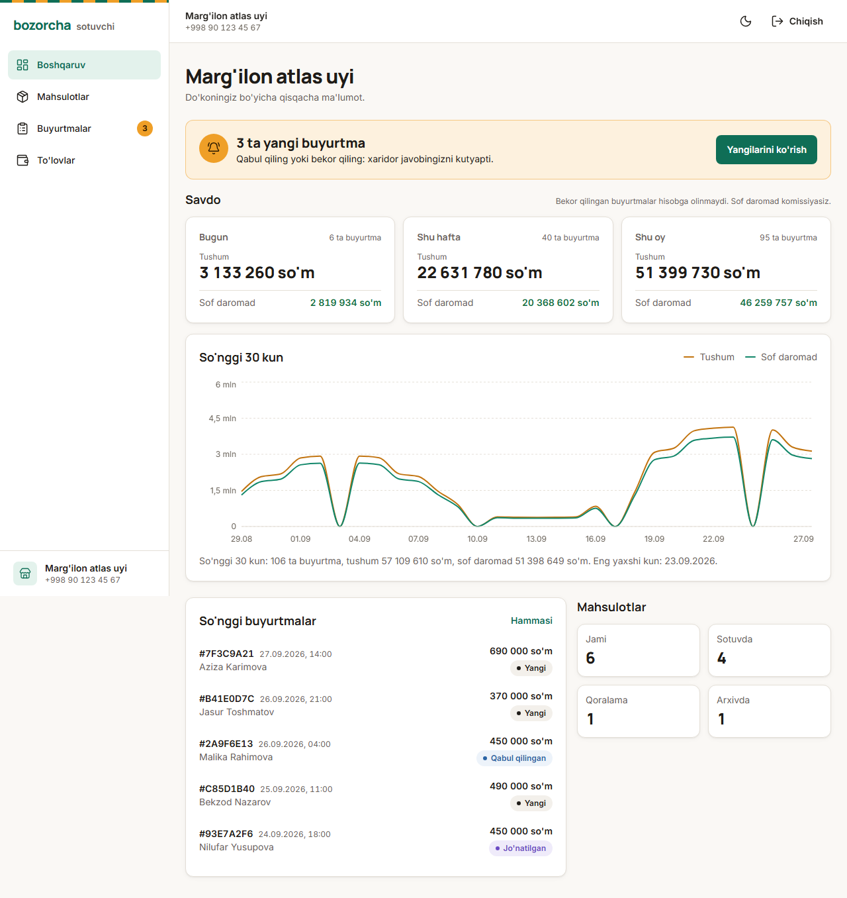
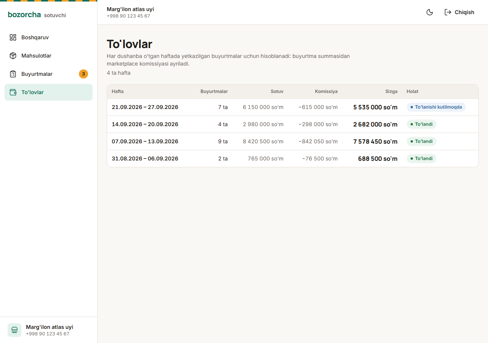
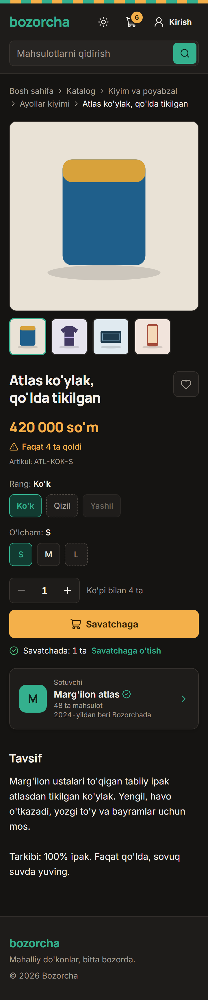
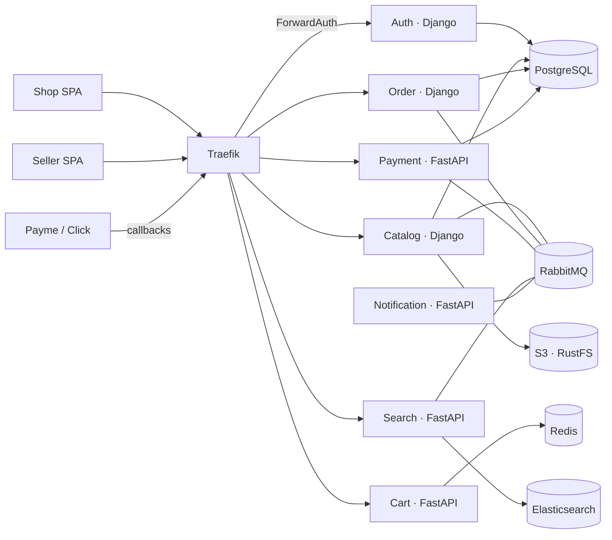
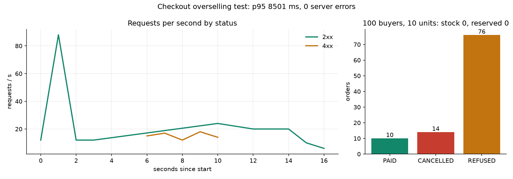
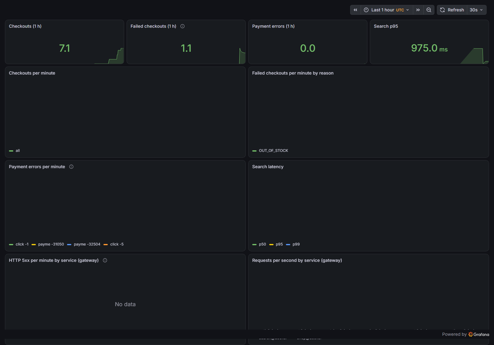

# Bozorcha — multi-vendor marketplace

A multi-seller marketplace built as a microservice monorepo: customers search, buy and pay
with Payme or Click, sellers run their own shop and get weekly payouts, and money never
leaves an order in an inconsistent state. [O'zbekcha qisqacha](#ozbekcha) below.



| Search with facets | Order waiting for payment |
|---|---|
|  |  |

| Seller dashboard | Weekly payouts | Mobile, dark |
|---|---|---|
|  |  |  |

## Architecture


```mermaid
flowchart LR
    shop[Shop SPA] --> traefik[Traefik]
    seller[Seller SPA] --> traefik
    traefik -->|ForwardAuth| auth[Auth · Django]
    traefik --> catalog[Catalog · Django]
    traefik --> order[Order · Django]
    traefik --> cart[Cart · FastAPI]
    traefik --> search[Search · FastAPI]
    traefik --> payment[Payment · FastAPI]
    payme[Payme / Click] -->|callbacks| traefik
    catalog --- rabbit[(RabbitMQ)]
    order --- rabbit
    payment --- rabbit
    search --- rabbit
    notification[Notification · FastAPI] --- rabbit
    auth --> pg[(PostgreSQL)]
    catalog --> pg
    order --> pg
    payment --> pg
    cart --> redis[(Redis)]
    search --> es[(Elasticsearch)]
    catalog --> s3[(S3 · RustFS)]
```

Each service owns its database and talks to the others only through events on a single
topic exchange (`marketplace.events`), plus a few internal read APIs that the gateway never
exposes. Every state change is written together with its outbox row in one transaction, and
every consumer is idempotent by `event_id`; failed deliveries are retried three times
(1 s, 5 s, 25 s) and then parked in a per-service dead letter queue.

| Service | Stack | Responsibility |
|---|---|---|
| auth | Django, DRF | phone + OTP login, RS256 JWT, seller applications, gateway ForwardAuth |
| catalog | Django, DRF, Celery | shops, categories, products, variants, stock reservations, images |
| order | Django, DRF | checkout, the order saga, sub-orders per seller, commissions |
| cart | FastAPI, Redis | guest and user carts, favourites, merge on login |
| search | FastAPI, Elasticsearch | search, facets, autocomplete, Uzbek Latin/Cyrillic transliteration |
| payment | FastAPI, SQLAlchemy | Payme and Click merchant APIs, refunds, weekly seller payouts |
| notification | FastAPI, Jinja2 | SMS, email and Telegram messages about orders and shops |

### The checkout saga

1. `POST /api/orders/checkout/` (with an `Idempotency-Key`) turns the cart into a PENDING
   order and publishes `order.created`.
2. The catalog reserves every item or none (`stock.reserved` / `stock.failed`); the order
   becomes RESERVED for 15 minutes or CANCELLED.
3. Payme or Click confirm the money; the payment service publishes `payment.paid`, the order
   becomes PAID and `order.paid` splits it into one sub-order per seller.
4. Sellers accept, ship and deliver; a cancelled sub-order is refunded; delivered sub-orders
   join the seller's payout for the week.

A payment that arrives after the reservation expired reserves the stock again; if it is gone
by then, the money is refunded automatically.

## Quick start

Requirements: Docker with Compose, GNU make, and [uv](https://docs.astral.sh/uv/) for
running tests outside containers.

```bash
cp .env.example .env    # then set the passwords and keys
make up                 # build and start the stack
make migrate && make seed && make reindex
make ps                 # every service should report healthy
```

| URL | What |
|---|---|
| `http://shop.localhost` | the shop |
| `http://seller.localhost` | the seller cabinet |
| `http://api.localhost/api/<service>/health/live` | service liveness through the gateway |
| `http://traefik.localhost` | routing dashboard |
| `http://rabbit.localhost` | broker management |
| `http://s3.localhost` | object storage (S3 API) |
| `http://mail.localhost` | captured outgoing email |
| `http://grafana.localhost` | dashboards (`make up-full`) |

With `DEBUG=True` the login code is always `000000` and a test payment method is offered.

## Payments

Payme and Click call the payment service, not the other way round, so two simulators play
the provider side against the running stack and check every answer. They need
`PAYME_KEY`, `CLICK_SERVICE_ID` and `CLICK_SECRET_KEY` in `.env` and `DEBUG=True`.

```bash
make payme-sim                     # Check -> Create -> Perform, duplicates, wrong amount,
                                   # expired order, cancel after perform, bad auth
make click-sim s="happy cancelled" # prepare -> complete, signature, duplicates
```

A repeated callback answers with the stored result and never writes the money twice.
Refunds (a seller cancelling a sub-order, a late payment whose stock ran out) are recorded
against the paid transaction and published as `payment.refunded`. Without live merchant
credentials the provider side of a refund is not called; the transaction is cancelled
locally. Sellers see their weekly payouts (Monday to Sunday, UTC) in the cabinet.

## Testing

| Level | Where | Command | What it proves |
|---|---|---|---|
| Unit | `libs/`, `services/*/tests`, `tools/tests` | `make test` | every service against real Postgres / Elasticsearch, ~1 200 tests |
| Frontend | `frontend/**/*.test.tsx` | `cd frontend && pnpm test` | components, pages and API hooks (Vitest), ~330 tests |
| System | `tests/integration` | `make test-integration` | gateway rules, the saga, search sync, Payme / Click, refunds, payouts, notifications on the running stack |
| End to end | `frontend/e2e` | `make test-e2e` | four browser scenarios (Playwright), below |
| Load | `tests/load` | `make load-test` | no overselling under 100 concurrent buyers (k6) |

End to end scenarios:

1. a guest searches, adds to the cart, logs in (the guest cart is merged), checks out, pays
   with the test method and finds the order in "Buyurtmalarim";
2. a seller creates a product with variants and an image; it is searchable within 10 s
   (measured: ~1–4 s);
3. a seller ships a sub-order and the customer sees the tracking number;
4. two customers race for the last unit: one order is PAID, the other CANCELLED.

### Overselling under load

100 customers try to buy a variant with 10 units at the same moment (add to cart, check out,
wait for the reservation, pay):



| Rule | Result |
|---|---|
| exactly 10 orders PAID | 10 |
| everyone else cancelled or refused at checkout | 14 cancelled + 76 refused |
| stock / reserved afterwards | 0 / 0 |
| 5xx responses | 0 |

Latency is the honest weak spot: checkout p95 is ~9 s at this burst because the order
service checks out synchronously (cart and catalog calls) on three gunicorn workers and the
gateway verifies every token with auth. Correctness holds; throughput would come from more
workers or an asynchronous checkout response.

CI (GitHub Actions) runs lint, the unit suites, mypy and the frontend for the parts a
change touched. System, e2e and load tests need the whole stack and run locally.

## Monitoring

`make up-full` adds Prometheus and Grafana with a provisioned dashboard: checkouts and failed
checkouts by reason (`checkout_total`, `checkout_failed_total{reason}`), payment callback
errors by provider and code (`payment_errors_total`), search latency percentiles
(`search_latency_seconds`) and requests / 5xx per service from Traefik.



## Security

| Rule | Proof |
|---|---|
| No secrets or key files in the repository; `.env.example` complete | `tools/check_secrets.py` (CI) |
| `/internal/*` is never routed by the gateway | `tests/integration/test_gateway.py::test_internal_routes_are_never_exposed` |
| Identity headers sent by a client are dropped | `test_gateway.py::test_spoofed_identity_headers_are_stripped` |
| A seller cannot see another shop's products or sub-orders | `catalog/tests/test_seller_api.py::test_other_sellers_product_is_not_found`, `order/tests/test_seller_read.py::test_detail_of_foreign_sub_order_is_404` |
| OTP is rate limited | per phone in auth (`auth/tests/test_otp.py::test_rate_limit_is_per_phone`), per address at the gateway (`otp-ratelimit`, 5 / min) |
| Payme Basic Auth and Click signatures are checked | `payment/tests/test_payme.py::test_bad_basic_auth_is_32504`, `test_click.py::test_bad_signature_is_minus_1` |
| Image uploads: content type and size limits | `catalog/tests/test_images.py::test_presign_rejects_other_content_types`, `test_task_rejects_originals_over_the_limit` |
| Non-root containers from pinned images | `tools/check_dockerfiles.py` (CI) |
| Without `DEBUG` the master OTP and both mock payments are off | `auth/tests/test_otp.py::test_master_code_is_rejected_without_debug`, `payment/tests/test_config.py`, the order mock view |

## Hard problems and how they are solved

- **Overselling.** A reservation is one guarded `UPDATE ... SET reserved = reserved + qty
  WHERE stock - reserved >= qty` per variant inside a transaction that holds all items or
  none ([`_take`](services/catalog/products/reservations.py#L181)). The k6 run above shows
  10 sales for 10 units with 100 buyers.
- **Deadlocks.** Variants are always locked in the same order (sorted ids,
  [`normalize`](services/catalog/products/reservations.py#L58)), so two orders that share
  products cannot wait on each other.
- **Outbox.** The business change and its event row commit together; a relay publishes with
  publisher confirms and marks rows only after the broker confirmed them
  ([`publish_pending`](libs/py-common/py_common/outbox.py#L37)), so a crash duplicates an
  event but never loses one.
- **Idempotency.** Consumers record `event_id` with the change
  ([`EventRouter.dispatch`](libs/py-common/py_common/consumer.py#L47)); checkout replays an
  `Idempotency-Key` ([`run_once`](services/order/orders/idempotency.py#L63)); Payme and Click
  callbacks lock the transaction row and return the stored result
  ([`PaymeMerchant.handle`](services/payment/app/providers/payme.py#L140)); notifications
  remember each delivered channel so a retry resends only the failed one
  ([`Notifier.notify`](services/notification/app/services/notifier.py#L58)).
- **Late payment.** Money that arrives after the reservation expired re-reserves the stock
  and either completes the order or refunds it
  ([`apply_payment`](services/order/orders/saga.py#L185),
  [`on_stock_failed`](services/order/orders/saga.py#L153)).
- **Search sync.** Product events are applied with the event time as an external version
  ([`ProductIndex.upsert`](services/search/app/services/index.py#L172)), so an old event
  arriving late cannot overwrite newer data; a full reindex swaps an alias.

## Development

```bash
make test        # shared libraries, repository checks and every service suite
make lint        # ruff check + format check
make typecheck   # mypy, strict
make gen-api     # OpenAPI schemas -> frontend API types
make down        # stop everything
```

Conventions: money is stored as integer tiyin (1 so'm = 100 tiyin) and never as a float,
identifiers are UUIDv7, timestamps are UTC, and the API error shape is
`{"error": {"code", "message", "details"}}` in every service.

## O'zbekcha

Bozorcha — ko'p sotuvchili marketplace: xaridor mahsulot qidiradi, savatchaga qo'shadi va
Payme yoki Click orqali to'laydi; sotuvchi o'z do'konini boshqaradi va har hafta hisob-kitob
oladi. Loyiha 7 ta mikroservisdan iborat (Django va FastAPI), ular faqat RabbitMQ hodisalari
orqali gaplashadi.

- **Ishga tushirish:** `cp .env.example .env`, so'ng `make up`, `make migrate`, `make seed`,
  `make reindex`. Do'kon — `http://shop.localhost`, sotuvchi kabineti —
  `http://seller.localhost`. Dev rejimda kirish kodi `000000`.
- **Ishonchlilik:** har bir o'zgarish hodisasi bilan bitta tranzaksiyada yoziladi (outbox),
  takroriy hodisa yoki to'lov chaqiruvi pulni ikki marta yozmaydi, yuk testida 100 xaridor
  10 dona mahsulot uchun bellashganda aynan 10 tasi sotildi.
- **Testlar:** `make test` (unit), `make test-integration` (tizim), `make test-e2e`
  (brauzer), `make load-test` (k6), `make payme-sim` / `make click-sim` (to'lov
  provayderlari simulyatori).

## License

Not published yet.
